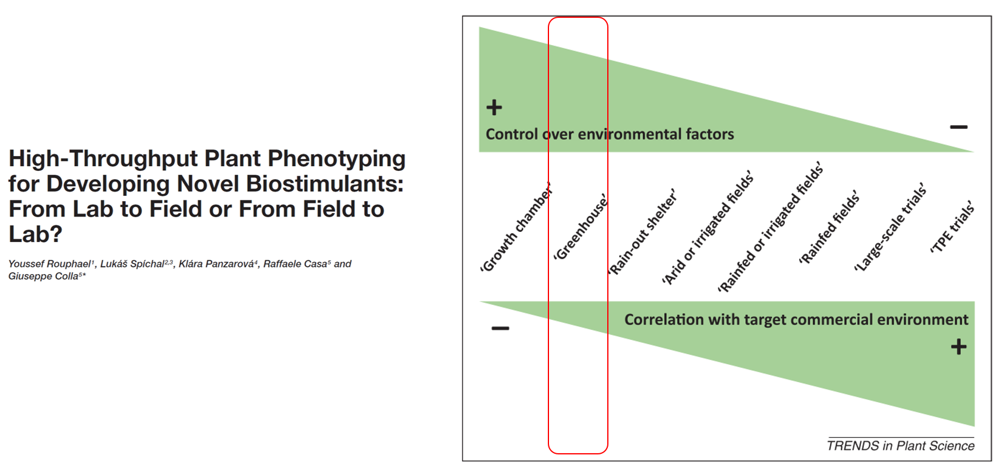

#Rafael Massahiro Yassue
       
 

---
#  Summary 
  + Introduction
    - Maize
    - Nitrogen 
    - Holobiont
    - Plant Growth-Promoting Bacteria
    - “Breeding pillars” and Phenomics
    - Components of electromagnetic spectrum
    - Plant Growth-Promoting Bacteria and HTTP
  + Goals
  + Material and methods
    - Pilot trial 
  + Results 
    - Orthomosaic
    - Genotyping-by-sequencing
    - Population structure
    - Population parameters
  + Outlook
  

---
#Maize 

---
#Nitrogen
- Average maize crop removes 160 kg/ha of nitrogen  

--

- BNF by PGPB has been reported to contribute up to 12–33% of total N uptake in maize (Montañez et al., 2009) 

--

- PGPR may be a good alternative to more sustainable production

--

- 300 maize-associated endophytes (mostly bacteria)  

--

- Based on the genomes currently in NCBI, bacteria and fungi contain an average of <b> 3,800 and 9,600 genes </b> , respectively. If we assume <b> 35 unique fungi and 175 </b>  unique bacteria per plant (see Sect. 14.2.4), it implies that the maize endosphere contains  <b> 858,000–1.14 million genes </b> , over twenty times that of the maize plant itself (Hardoim et al., 2015).  

---
#Holobiont

--

---
#Plant Growth-Promoting Bacteria

---
#Plant Growth-Promoting Bacteria

---
#Plant Growth-Promoting Bacteria
  

---
#Plant Growth-Promoting Bacteria
 
 

---
#Plant Growth-Promoting Bacteria
  

---
#Plant Growth-Promoting Bacteria

- Type of Soil (Oliveira et al., 2006)  

--

- Genotype x PGPB  (Montañez et al., 2009)  

--

- Environment interaction (Rouphael et al., 2018)  

--

- Nitrogen disponibility (Egamberdiyeva, 2007)  

--

- Microbiome x microbiome interaction (Van Der Heijden et al., 2008)

--

- Heterosis (Vidotti et al. 2019, preprint Wagner et al. 2020)

---
# “Breeding pillars” and Phenomics

---
# “Breeding pillars” and Phenomics

---
#Components of electromagnetic spectrum

--

---
#Plant Growth-Promoting Bacteria

---
#Plant Growth-Promoting Bacteria

---
#Plant Growth-Promoting Bacteria and HTTP

---
#Plant Growth-Promoting Bacteria and HTTP

---
#Goal
- Genetic and phenotypic characterization of maize inbred lines for response to plant growth-promoting bacteria

--

- Implementation of a High-Throughput Phenotyping platform in the greenhouse

--

- Prospecting new traits that may be associated with a positive response to plant x PGPB interaction

---
#Material and methods

- Greenhouse condition

--

- 360 inbred lines, with and without PGPB

--

- V2, V4, and V6 

| Classic phenotyping | High-throughput phenotyping  |
| ------------- | ------------- |
| Plant height (3x) | NDVI (3x) |
| Stalk diameter | NDVIred (3x) |
| Number of leaves (3x) | NDVIgreen (3x) |
| Chlorophyll content (3x) | Chlorophyll indices (3x) |
| Canopy mass | Canopy temperature (3x) |
| Dry mass of canopy and root | Plant height (3x) |
| | WinRHIZO | 

---
# Material and methods
Table. Blend of Bacterias 

|Bacteria	|Mechanism|
|------|-------|
|<i>Bacillus </i>sp. RZ2MZ9 |	P solubilization, ACC deaminase activity and ammonia and IAA production|
|<i> Azospirillum brasilense </i> Ab-v5 	|Fixing N2 and synthesis of phytohormones|
|<i> Pantoea agglomerans </i> 33.1	|Synthesize indoleacetic acid and solubilize phosphate|
|<i> Delftia </i> sp. 93A. 	|High nitrogen-fixing activity and acetylene reduction|

---
# Material and methods

- Augmented blocks (Federer), 6 blocks with 60 lines and 3 checks with and without PGPB (I)
  \begin{aligned}
y=X 1 \boldsymbol{g}+X 2 \boldsymbol{b}+X 3 \boldsymbol{c}+X 4 \boldsymbol{p}+X 5 \boldsymbol{i}+\boldsymbol{\varepsilon}
  \end{aligned}
  
--

- Sown three times (II)
  \begin{aligned}
y=x 1 g+X 2 e+X 3 p+X 4 i+\varepsilon
  \end{aligned}

g effects of genotype  
b effects of blocks   
c effects of checks   
p effect of inoculation with PGPB   
e effect experiment effect of   
i effect of interaction genotype x inoculation with the PGPB    
𝜺 ~𝑁(0, 𝑹).

---
# Pilot trial

- Type of soil

--

- Microbiome

--

- Fertilization – Hoagland without Nitrogen

--

- Data collection pipeline and image processing – Metashape and QGIS

---
# Pilot trial
 
.pull-left[]
.pull-right[]
   
.middle[Figure. Collection of thermal (left) and multispectral (right) images]

---

# Orthomosaic 

.pull-bottom[.center[]]
Figure. Orthomosaic using multispectral camera

---
# Genotyping-by-sequencing 

.pull-left[ - SNP: 14639    - Two enzymes approach - Pst1-MSE1 (Poland, 2011)   - SNPCalling: TASSEL 5.0    - Aligner: Bowtie 2   - Imputation: Beagle 5.0
                            ]
--

.pull-right[  ]

 
.bottom[  Figure. Raw data coverage (A), and depth (B), Filtered data coverage (C), and depth (D)  ]

---
# Population structure

.pull-left[]
.pull-right[]
 
.middle[Figure. Proportion of variation accumulated (A) and Cumulative proportion of variance explained by the principal components (1, 2 and 3, B)]

---

# Population structure

  
Figure. Genotypes sorted by origin (A) and group (K) (B)

---
# Population structure

Figure. Additive (Ga), and dominance (Gd) relationship matrix
---
# Population parameters 
|Parameter	|Esalq	|Iapar	|All |
| ------------- | ------|----- |-----|
|Ne	|101.50	        |98.82	        |199.83|
|Va	|4385.2	|4422.9	|4493.14|
|Vd	|1635.88	|1635.27	|1644.02|
|Number of fixed alleles	|30	|80	|..|
|GD	|0.3	|0.3	|0.31|
|PIC	|0.24	|0.25	|0.25|
|MAF	|0.21	|0.22	|0.22|
|Ho	|0.03	|0.03	|0.03|
|F	|0.89	|0.91	|0.9|

--
#### F-statistics 
|Pop	|Fis	|Fst|	Fit|
|-----|----|------|-------|
|Esalq x Iapar|	0.901|	0.021|	0.902|

---
#Outlook

- Hyperspectral camera

--

- Random regression from high-throughput phenotyping data with Association Weight Matrix
---
                   
# .center[Thank you] 

###.right[ Rafael Massahiro Yassue ]
.right[]

